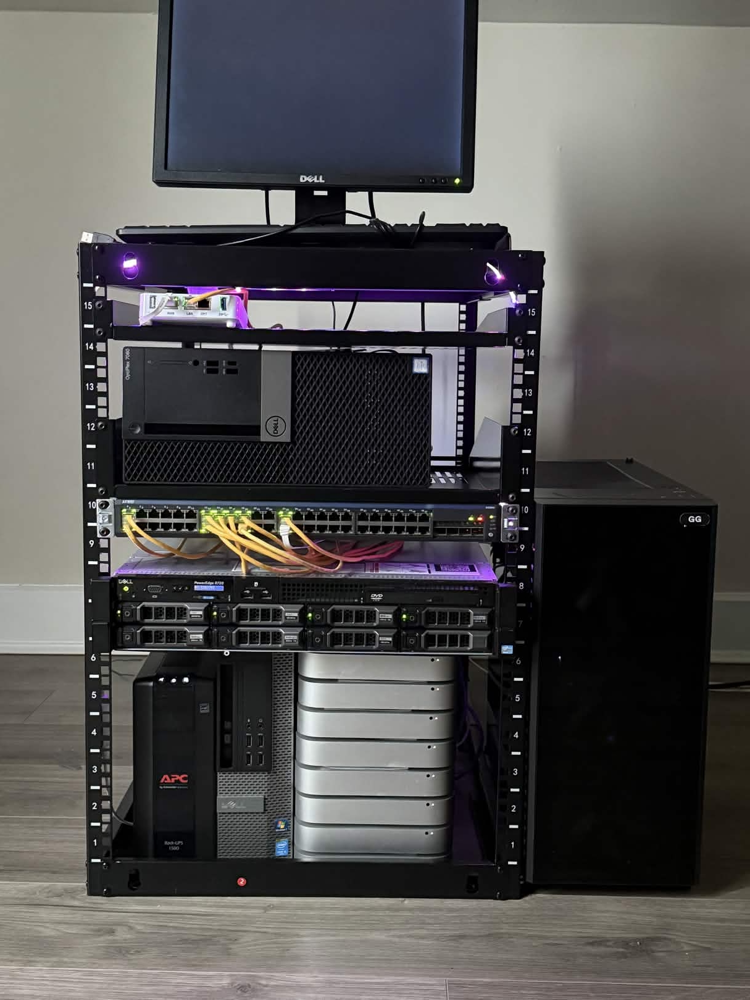

<h1 align="center">Homelab Infrastructure</h1>

  Personal homelab focused on <b>virtualization</b>, <b>network segmentation</b>, <b>cybersecurity</b>, <b>self-hosting</b>, and <b>Kubernetes experimentation</b>.

  
  
  
  
  
  

---

## Overview

This repository documents my personal homelab environment used to build hands-on experience in:

<ul>
  <li>Network design and VLAN segmentation</li>
  <li>Firewalling and internal security boundaries</li>
  <li>Virtualization with Proxmox</li>
  <li>Kubernetes orchestration with K3s</li>
  <li>Security monitoring with Wazuh and ELK</li>
  <li>Self-hosted infrastructure and internal services</li>
</ul>

The lab is designed like a small enterprise-style environment, with isolated networks for private infrastructure, guest devices, and public-facing services.

---

## Images

### Physical Lab

  

<i>Place your physical lab photo at <code>assets/homelab-rack.jpg</code></i>

### Network Diagram

  

<i>Place your network diagram at <code>assets/network-diagram.png</code></i>

---

## Architecture Summary

<table>
  <tr>
    <th align="left">Component</th>
    <th align="left">Purpose</th>
  </tr>
  <tr>
    <td>Netgate Firewall (pfSense)</td>
    <td>Internal security boundary, VLAN routing, firewall rules, segmentation</td>
  </tr>
  <tr>
    <td>Juniper EX2200-48T</td>
    <td>Managed switching, VLAN trunking, access port assignments</td>
  </tr>
  <tr>
    <td>Dell PowerEdge R720</td>
    <td>Main virtualization host running Proxmox and core lab services</td>
  </tr>
  <tr>
    <td>K3s Cluster</td>
    <td>Container orchestration and distributed workload experimentation</td>
  </tr>
  <tr>
    <td>ELK + Wazuh</td>
    <td>Security monitoring, logging, event analysis, and alerting</td>
  </tr>
  <tr>
    <td>Ollama AI Server</td>
    <td>Local LLM experimentation and private AI workloads</td>
  </tr>
</table>

---

## Network Design

The homelab is segmented into separate VLANs to isolate systems by purpose.

<table>
  <tr>
    <th align="left">VLAN</th>
    <th align="left">Subnet</th>
    <th align="left">Purpose</th>
  </tr>
  <tr>
    <td><b>VLAN 20</b></td>
    <td><code>192.168.20.0/24</code></td>
    <td>Private infrastructure and internal services</td>
  </tr>
  <tr>
    <td><b>VLAN 30</b></td>
    <td><code>192.168.30.0/24</code></td>
    <td>Guest devices and isolated wireless access</td>
  </tr>
  <tr>
    <td><b>VLAN 40</b></td>
    <td><code>192.168.40.0/24</code></td>
    <td>Public-facing/self-hosted services</td>
  </tr>
</table>

### VLAN Purpose Breakdown

<table>
  <tr>
    <th align="left">Segment</th>
    <th align="left">Examples</th>
  </tr>
  <tr>
    <td>Private VLAN</td>
    <td>ELK stack, password manager, Kubernetes controller, AI server, internal storage</td>
  </tr>
  <tr>
    <td>Public VLAN</td>
    <td>Nextcloud, portfolio web server</td>
  </tr>
  <tr>
    <td>Guest VLAN</td>
    <td>Wireless AP and end-user guest devices</td>
  </tr>
</table>

---

## Core Infrastructure

### Firewall

<b>Netgate Firewall running pfSense</b>

This firewall does not sit at the apartment edge.  
Instead, it acts as the security boundary for <b>my homelab environment only</b>, allowing me to segment, monitor, and secure my infrastructure without inspecting or interfering with roommate traffic.

Responsibilities include:

<ul>
  <li>VLAN routing</li>
  <li>Firewall rule enforcement</li>
  <li>Traffic isolation between segments</li>
  <li>Controlled outbound internet access</li>
</ul>

### Switch

<b>Juniper EX2200-48T</b>

Used for:

<ul>
  <li>Access port configuration</li>
  <li>802.1Q VLAN trunking</li>
  <li>Segmentation between private, guest, and public networks</li>
</ul>

### Virtualization Host

<b>Dell PowerEdge R720</b>

<table>
  <tr>
    <th align="left">Specification</th>
    <th align="left">Value</th>
  </tr>
  <tr>
    <td>CPU</td>
    <td>Dual Intel Xeon E5-2690 v2</td>
  </tr>
  <tr>
    <td>Memory</td>
    <td>128 GB RAM</td>
  </tr>
  <tr>
    <td>Storage</td>
    <td>4 × 4TB drives</td>
  </tr>
  <tr>
    <td>Hypervisor</td>
    <td>Proxmox VE</td>
  </tr>
</table>

This server hosts multiple VMs and services used throughout the lab.

---

## Kubernetes Cluster

The lab includes a <b>K3s-based Kubernetes cluster</b> used to learn container orchestration and distributed workloads.

### Cluster Components

<table>
  <tr>
    <th align="left">Node Type</th>
    <th align="left">Description</th>
  </tr>
  <tr>
    <td>Controller</td>
    <td>VM hosted on the R720, running Rancher and Kubernetes control services</td>
  </tr>
  <tr>
    <td>Workers</td>
    <td>8 × Mac Mini 2014 nodes connected on the private VLAN</td>
  </tr>
</table>

### Cluster Goals

<ul>
  <li>Deploy and manage containerized applications</li>
  <li>Learn service exposure, ingress, and node scheduling</li>
  <li>Experiment with lightweight orchestration in a home environment</li>
</ul>

---

## Services Running in the Lab

<table>
  <tr>
    <th align="left">Service</th>
    <th align="left">Purpose</th>
  </tr>
  <tr>
    <td>Nextcloud</td>
    <td>Personal cloud storage and file access</td>
  </tr>
  <tr>
    <td>Portfolio Web Server</td>
    <td>Hosts my personal portfolio website</td>
  </tr>
  <tr>
    <td>ELK Stack</td>
    <td>Centralized log collection and analysis</td>
  </tr>
  <tr>
    <td>Wazuh</td>
    <td>SIEM / security monitoring and alerting</td>
  </tr>
  <tr>
    <td>Password Manager</td>
    <td>Internal credential management service</td>
  </tr>
  <tr>
    <td>Ollama + OpenWebUI</td>
    <td>Local large language model experimentation</td>
  </tr>
</table>

---

## Monitoring and Security

This environment is used to build practical experience with security-focused infrastructure.

### Security Concepts Practiced

<ul>
  <li>Internal segmentation with VLANs</li>
  <li>Firewall policy design</li>
  <li>Centralized log collection</li>
  <li>SIEM monitoring and alerting</li>
  <li>Isolation of guest and public-facing services</li>
</ul>

### Tooling

<ul>
  <li><b>Wazuh</b> for endpoint visibility and security event monitoring</li>
  <li><b>ELK Stack</b> for log aggregation and analysis</li>
  <li><b>pfSense</b> for traffic control and policy enforcement</li>
</ul>

---

## Power Protection and Backup

An <b>APC 1500VA UPS</b> provides battery backup for critical infrastructure, including:

<ul>
  <li>Dell R720</li>
  <li>Netgate firewall</li>
  <li>Juniper EX2200 switch</li>
  <li>Backup NAS</li>
</ul>

This helps protect services during outages and supports graceful shutdown when needed.

---

## Why I Built This Lab

I built this lab to get real hands-on experience with technologies used in infrastructure and cybersecurity roles.

This environment gives me a place to practice:

<ul>
  <li>Enterprise-style networking concepts</li>
  <li>Virtualization and VM management</li>
  <li>Container orchestration</li>
  <li>Security monitoring workflows</li>
  <li>Self-hosted service deployment</li>
  <li>Infrastructure troubleshooting and documentation</li>
</ul>

Rather than only learning concepts in class, this lab lets me build, break, secure, and improve real systems.

---

## Future Improvements

<ul>
  <li>Expand Kubernetes workloads and services</li>
  <li>Add more infrastructure automation</li>
  <li>Improve dashboards and observability</li>
  <li>Refine SIEM alerting workflows</li>
  <li>Document individual projects in separate repositories</li>
</ul>

