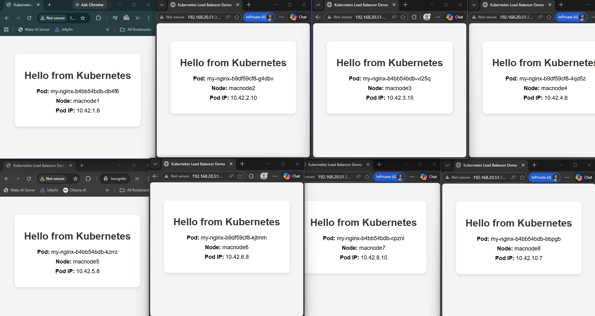
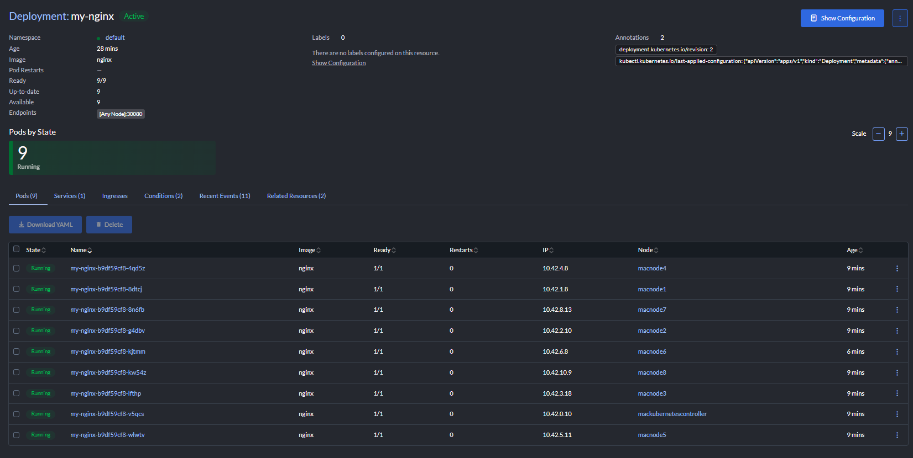

<h1 align="center">Kubernetes Load Balancing Demo</h1>

  Demonstration showing how Kubernetes distributes traffic across multiple replicated pods using a <b>NodePort service</b> and automatic <b>pod scheduling</b>.

  
  
  
  

---

## Goal

This demo shows how Kubernetes automatically distributes workloads across cluster nodes.

Multiple nginx pods are deployed, and each pod generates a webpage displaying:

- pod name
- node name
- pod IP

By refreshing the page or opening multiple browser windows, it becomes clear which pod handled each request.

---

## Deployment Configuration

<table>

<tr>
<th align="left">Setting</th>
<th align="left">Value</th>
</tr>

<tr>
<td>Deployment Name</td>
<td>my-nginx</td>
</tr>

<tr>
<td>Container Image</td>
<td>nginx:latest</td>
</tr>

<tr>
<td>Service Type</td>
<td>NodePort</td>
</tr>

<tr>
<td>Cluster Port</td>
<td>80</td>
</tr>

<tr>
<td>NodePort</td>
<td>30080</td>
</tr>

<tr>
<td>Replicas</td>
<td>9 pods</td>
</tr>

</table>

---

## What the Demo Shows

<table>

<tr>
<th align="left">Concept</th>
<th align="left">Explanation</th>
</tr>

<tr>
<td>Replication</td>
<td>Multiple pods run the same container image</td>
</tr>

<tr>
<td>Scheduling</td>
<td>Kubernetes distributes pods across different nodes</td>
</tr>

<tr>
<td>Service Routing</td>
<td>Requests are routed through a single service endpoint</td>
</tr>

<tr>
<td>Load Distribution</td>
<td>Traffic is spread across the available pods</td>
</tr>

</table>

---

## Demo Output

Multiple browser sessions connecting to different pods across the cluster.

Multiple Nginx deployments running in different pods on different nodes.

---

## Observations

From testing the deployment:

- pods were automatically scheduled across several nodes
- each request returned a different pod identity
- Rancher confirmed all pods were running and healthy
- the service allowed all replicas to be accessed through a single endpoint

This demonstrates the core concept of **horizontal scaling and load balancing in Kubernetes**.

---

## Why This Demo is Useful

This small deployment clearly demonstrates several important Kubernetes concepts:

- distributed workloads
- pod replication
- service abstraction
- node scheduling

It is a simple but effective way to visualize how Kubernetes handles application scaling.
